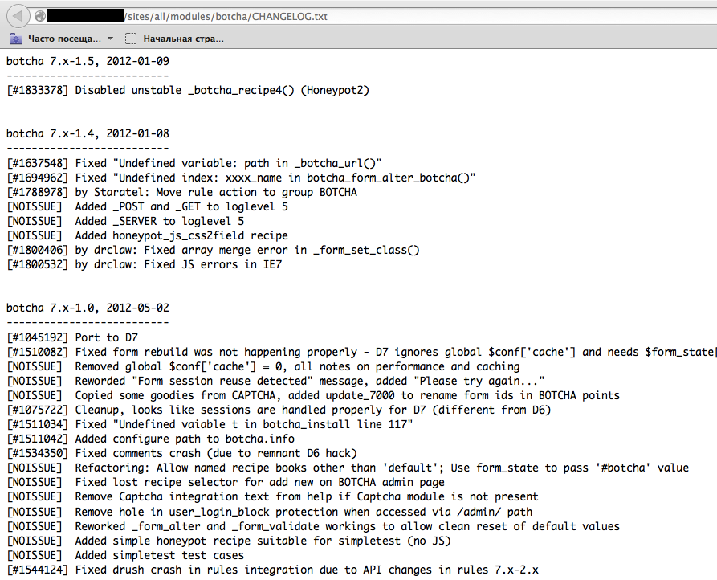
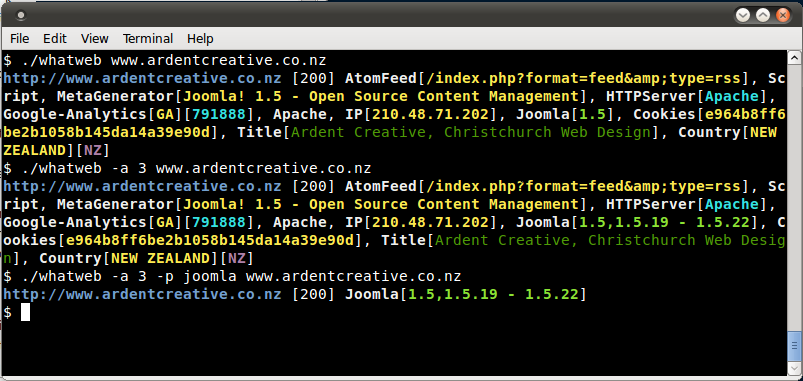
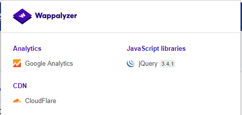

# Fingerprint Web Application

|ID          |
|------------|
|WSTG-INFO-09|

## Summary

There is nothing new under the sun, and nearly every web application that one may think of developing has already been developed. With the vast number of free and open source software projects that are actively developed and deployed around the world, it is very likely that an application security test will face a target site that is entirely or partly dependent on these well known applications (e.g. Wordpress, phpBB, Mediawiki, etc). Knowing the web application components that are being tested significantly helps in the testing process and will also drastically reduce the effort required during the test. These well known web applications have known HTML headers, cookies, and directory structures that can be enumerated to identify the application.

## Test Objectives

Identify the web application and version to determine known vulnerabilities and the appropriate exploits to use during testing.

## How to Test

### Cookies

A relatively reliable way to identify a web application is by the application-specific cookies.

Consider the following HTTP-request:

```html
GET / HTTP/1.1
Host: blog.example.org
User-Agent: Mozilla/5.0 (Windows NT 6.2; WOW64; rv:31.0) Gecko/20100101 Firefox/31.0
Accept: text/html,application/xhtml+xml,application/xml;q=0.9,*/*;q=0.8
Accept-Language: en-US,en;q=0.5
Cookie: wp-settings-time-1=1406093286; wp-settings-time-2=1405988284
DNT: 1
Connection: keep-alive
```

The cookie *wp-settings-time-1* has automatically been set, which gives information about the framework being used. List of common cookies names is presented in [Common Application Identifiers](#common-application-identifiers) section. However, it is possible to change the name of the cookie.

### HTML Source Code

This technique is based on finding certain patterns in the HTML page source code. Often one can find a lot of information which helps a tester to recognize a specific web application. One of the common markers are HTML comments that directly lead to application disclosure. More often certain application-specific paths can be found, i.e. links to application-specific CSS or JS folders. Finally, specific script variables might also point to a certain application.

From the meta tag below, one can easily learn the application used by a website and its version. The comment, specific paths and script variables can all help an attacker to quickly determine an instance of an application.

```html
<meta name="generator" content="WordPress 3.9.2" />
```

More frequently such information is placed between
`<head>` `</head>`tags, in `<meta>` tags or at the end of the page. Nevertheless, it is recommended to check the whole document since it can be useful for other purposes such as inspection of other useful comments and hidden fields.

### Specific Files and Folders

Apart from information gathered from HTML sources, there is another approach which greatly helps an attacker to determine the application with high accuracy. Every application has its own specific file and folder structure on the server. It has been pointed out that one can see the specific path from the HTML page source but sometimes they are not explicitly presented there and still reside on the server.

In order to uncover them a technique known as dirbusting is used. Dirbusting is brute forcing a target with predictable folder and file names and monitoring HTTP-responses to emumerate server contents. This information can be used both for finding default files and attacking them, and for fingerprinting the web application. Dirbusting can be done in several ways, the example below shows a successful dirbusting attack against a WordPress-powered target with the help of defined list and intruder functionality of Burp Suite.

\
*Figure 4.1.9-1: Dirbusting with Burp*

We can see that for some WordPress-specific folders (for instance, `/wp-includes/`, `/wp-admin/` and `/wp-content/`) HTTP-reponses are 403 (Forbidden), 302 (Found, redirection to wp-login.php) and 200 (OK) respectively. This is a good indicator that the target is WordPress-powered. The same way it is possible to dirbust different application plugin folders and their versions. On the screenshot below one can see a typical CHANGELOG file of a Drupal plugin, which provides information on the application being used and discloses a vulnerable plugin version.

\
*Figure 4.1.9-2: Drupal Botcha Disclosure*

Tip: before starting dirbusting, it is recommended to check the robots.txt file first. Sometimes application specific folders and other sensitive information can be found there as well. An example of such a robots.txt file is presented on a screenshot below.

\
*Figure 4.1.9-3: Robots Info Disclosure*

Specific files and folders are different for each specific application. It is recommended to install the corresponding application during penetration tests in order to have better understanding of what infrastructure is presented and what files might be left on the server. However, several good file lists already exist and one good example is [FuzzDB wordlists of predictable files/folders](https://github.com/fuzzdb-project/fuzzdb).

## Common Application Identifiers

### Cookies

|              |               |
|--------------|---------------|
| phpBB        | phpbb3_   |
| Wordpress    | wp-settings |
| 1C-Bitrix    | BITRIX_ |
| AMPcms       | AMP |
| Django CMS   | django |
| DotNetNuke   | DotNetNukeAnonymous |
| e107         | e107_tz |
| EPiServer    | EPiTrace, EPiServer |
| Graffiti CMS | graffitibot |
| Hotaru CMS   | hotaru_mobile |
| ImpressCMS   | ICMSession |
| Indico       | MAKACSESSION |
| InstantCMS   | InstantCMS[logdate] |
| Kentico CMS  | CMSPreferredCulture |
| MODx         | SN4[12symb] |
| TYPO3        | fe_typo_user |
| Dynamicweb   | Dynamicweb |
| LEPTON       | lep[some_numeric_value]+sessionid |
| Wix          | Domain=.wix.com |
| VIVVO        | VivvoSessionId |

### HTML Source Code

| Application  |  Keyword |
|--------------|----------|
| Wordpress    | `<meta name="generator" content="WordPress 3.9.2" />` |
| phpBB        | `&lt;body id=“phpbb”` |
| Mediawiki    | `<meta name="generator" content="MediaWiki 1.21.9" />` |
| Joomla       | `<meta name="generator" content="Joomla! - Open Source Content Management" />` |
| Drupal       | `<meta name="Generator" content="Drupal 7 (http://drupal.org)" />` |
| DotNetNuke   | DNN Platform - [http://www.dnnsoftware.com](http://www.dnnsoftware.com) |

## Tools

A list of general and well-known tools is presented below. There are also a lot of other utilities, as well as framework-based fingerprinting tools.

### WhatWeb

Website: [https://github.com/urbanadventurer/WhatWeb](https://github.com/urbanadventurer/WhatWeb)

Currently one of the best fingerprinting tools on the market. Included in a default [Kali Linux](https://www.kali.org/) build. Language: Ruby Matches for fingerprinting are made with:

- Text strings (case sensitive)
- Regular expressions
- Google Hack Database queries (limited set of keywords)
- MD5 hashes
- URL recognition
- HTML tag patterns
- Custom ruby code for passive and aggressive operations

Sample output is presented on a screenshot below:

\
*Figure 4.1.9-4: Whatweb Output Sample*

### BlindElephant

Website:[http://blindelephant.sourceforge.net/](http://blindelephant.sourceforge.net/)

This great tool works on the principle of static file checksum based version difference thus providing a very high quality of fingerprinting. Language: Python

Sample output of a successful fingerprint:

```bash
pentester$ python BlindElephant.py http://my_target drupal
Loaded /Library/Python/2.7/site-packages/blindelephant/dbs/drupal.pkl with 145 versions, 478 differentiating paths, and 434 version groups.
Starting BlindElephant fingerprint for version of drupal at http://my_target

Hit http://my_target/CHANGELOG.txt
File produced no match. Error: Retrieved file doesn't match known fingerprint. 527b085a3717bd691d47713dff74acf4

Hit http://my_target/INSTALL.txt
File produced no match. Error: Retrieved file doesn't match known fingerprint. 14dfc133e4101be6f0ef5c64566da4a4

Hit http://my_target/misc/drupal.js
Possible versions based on result: 7.12, 7.13, 7.14

Hit http://my_target/MAINTAINERS.txt
File produced no match. Error: Retrieved file doesn't match known fingerprint. 36b740941a19912f3fdbfcca7caa08ca

Hit http://my_target/themes/garland/style.css
Possible versions based on result: 7.2, 7.3, 7.4, 7.5, 7.6, 7.7, 7.8, 7.9, 7.10, 7.11, 7.12, 7.13, 7.14

...

Fingerprinting resulted in:
7.14


Best Guess: 7.14
```

### Wappalyzer

Website: [https://www.wappalyzer.com/](https://www.wappalyzer.com/)

Wapplyzer is a Firefox Chrome extension. It works only on regular expression matching and doesn't need anything other than the page to be loaded on browser. It works completely at the browser level and gives results in the form of icons. Although sometimes it has false positives, this is very handy to have notion of what technologies were used to construct a target website immediately after browsing a page.

Sample output of a plug-in is presented on a screenshot below.

\
*Figure 4.1.9-5: Wappalyzer Output for OWASP Website*

## References

### Whitepapers

- [Saumil Shah: “An Introduction to HTTP fingerprinting”](https://web.archive.org/web/20190526182734/https://net-square.com/httprint_paper.html)

- [Anant Shrivastava : “Web Application Finger Printing”](https://anantshri.info/articles/web_app_finger_printing.html)

## Remediation

The general advice is to use several of the tools described above and check logs to better understand what exactly helps an attacker to disclose the web framework. By performing multiple scans after changes have been made to hide framework tracks, it's possible to achieve a better level of security and to make sure of the framework can not be detected by automatic scans. Below are some specific recommendations by framework marker location and some additional interesting approaches.

### HTTP Headers

Check the configuration and disable or obfuscate all HTTP-headers that disclose information the technologies used. Here is an interesting article about HTTP-headers obfuscation using Netscaler

### Cookies

It is recommended to change cookie names by making changes in the corresponding configuration files.

#### HTML Source Code

Manually check the contents of the HTML code and remove everything that explicitly points to the framework.

General guidelines:

- Make sure there are no visual markers disclosing the framework
- Remove any unnecessary comments (copyrights, bug information, specific framework comments)
- Remove META and generator tags
- Use the companies own CSS or JS files and do not store those in a framework-specific folders
- Do not use default scripts on the page or obfuscate them if they must be used.

#### Specific Files and Folders

General guidelines:

- Remove any unnecessary or unused files on the server. This implies text files disclosing information about versions and installation too.
- Restrict access to other files in order to achieve 404-response when accessing them from outside. This can be done, for example, by modifying htaccess file and adding RewriteCond or RewriteRule there. An example of such restriction for two common WordPress folders is presented below.

```apache
RewriteCond %{REQUEST_URI} /wp-login\.php$ [OR]
RewriteCond %{REQUEST_URI} /wp-admin/$
RewriteRule $ /http://your_website [R=404,L]
```

However, these are not the only ways to restrict access. In order to automate this process, certain framework-specific plugins exist. One example for WordPress is [StealthLogin](https://wordpress.org/plugins/stealth-login-page).

#### Additional Approaches

General guidelines:

- Checksum management
  The purpose of this approach is to beat checksum-based scanners and not let them disclose files by their hashes. Generally, there are two approaches in checksum management:

  - Change the location of where those files are placed (i.e. move them to another folder, or rename the existing folder)
  - Modify the contents - even slight modification results in a completely different hash sum, so adding a single byte in the end of the file should not be a big problem.

- Controlled chaos
  A funny and effective method that involves adding bogus files and folders from other frameworks in order to fool scanners and confuse an attacker. But be careful not to overwrite existing files and folders and to break the current framework!
