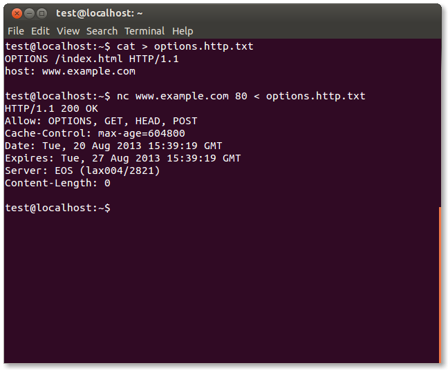

# Testing for HTTP Verb Tampering

|ID          |
|------------|
|WSTG-INPV-03|

## Summary

HTTP Verb Tampering tests the web application's response to different HTTP methods accessing system objects. For every system object discovered during spidering, the tester should attempt accessing all of those objects with every HTTP method.

The HTTP specification includes request methods other than the standard GET and POST requests. A standards compliant web server may respond to these alternative methods in ways not anticipated by developers. Although the common description is `verb` tampering, the HTTP 1.1 standard refers to these request types as different HTTP `methods`.

The full [HTTP 1.1 specification](https://www.w3.org/Protocols/rfc2616/rfc2616-sec9.html) defines the following valid HTTP request methods, or verbs:

- [`OPTIONS`](https://www.w3.org/Protocols/rfc2616/rfc2616-sec9.html#sec9.2)
- [`GET`](https://www.w3.org/Protocols/rfc2616/rfc2616-sec9.html#sec9.3)
- [`HEAD`](https://www.w3.org/Protocols/rfc2616/rfc2616-sec9.html#sec9.4)
- [`POST`](https://www.w3.org/Protocols/rfc2616/rfc2616-sec9.html#sec9.5)
- [`PUT`](https://www.w3.org/Protocols/rfc2616/rfc2616-sec9.html#sec9.6)
- [`DELETE`](https://www.w3.org/Protocols/rfc2616/rfc2616-sec9.html#sec9.7)
- [`TRACE`](https://www.w3.org/Protocols/rfc2616/rfc2616-sec9.html#sec9.8)
- [`CONNECT`](https://www.w3.org/Protocols/rfc2616/rfc2616-sec9.html#sec9.9)

If enabled, the Web Distributed Authoring and Version [(WebDAV)](http://www.webdav.org/specs/rfc2518.html) [extensions](https://tools.ietf.org/html/rfc4918) permit several more HTTP methods:

- [`PROPFIND`](http://www.webdav.org/specs/rfc2518.html#METHOD_PROPFIND)
- [`PROPPATCH`](http://www.webdav.org/specs/rfc2518.html#METHOD_PROPPATCH)
- [`MKCOL`](http://www.webdav.org/specs/rfc2518.html#METHOD_MKCOL)
- [`COPY`](http://www.webdav.org/specs/rfc2518.html#METHOD_COPY)
- [`MOVE`](http://www.webdav.org/specs/rfc2518.html#METHOD_MOVE)
- [`LOCK`](http://www.webdav.org/specs/rfc2518.html#METHOD_LOCK)
- [`UNLOCK`](http://www.webdav.org/specs/rfc2518.html#METHOD_UNLOCK)

However, most web applications only need to respond to GET and POST requests, providing user data in the URL query string or appended to the request respectively. The standard `<a href=""></a>` style links trigger a GET request; form data submitted via
`<form method='POST'></form>`trigger POST requests. Forms defined without a method also send data via GET by default.

Oddly, the other valid HTTP methods are not supported by the [HTML standard](https://www.w3.org/TR/REC-html40/interact/forms.html#h-17.13.1). Any HTTP method other than GET or POST needs to be called outside the HTML document. However, JavaScript and AJAX calls may send methods other than GET and POST.

As long as the web application being tested does not specifically call for any non-standard HTTP methods, testing for HTTP verb tampering is quite simple. If the server accepts a request other than GET or POST, the test fails. The solutions is to disable all non GET or POST functionality within the web application server, or in a web application firewall.

If methods such as HEAD or OPTIONS are required for your application, this increases the burden of testing substantially. Each action within the system will need to be verified that these alternate methods do not trigger actions without proper authentication or reveal information about the contents or workings web application. If possible, limit alternate HTTP method usage to a single page that contains no user actions, such the default landing page (example: index.html).

## How to Test

As the HTML standard does not support request methods other than GET or POST, we will need to craft custom HTTP requests to test the other methods. We highly recommend using a tool to do this, although we will demonstrate how to do manually as well.

### Manual HTTP Verb Tampering Testing

This example is written using the netcat package from openbsd (standard with most Linux distributions). You may also use telnet (included with Windows) in a similar fashion.

#### 1. Crafting custom HTTP requests

Each HTTP 1.1 request follows the following basic formatting and syntax. Elements surrounded by brackets `[ ]` are contextual to your application. The empty newline at the end is required.

```html
[METHOD] /[index.htm] HTTP/1.1
host: [www.example.com]
```

In order to craft separate requests, you can manually type each request into netcat or telnet and examine the response. However, to speed up testing, you may also store each request in a separate file. This second approach is what we'll demonstrate in these examples. Use your favorite editor to create a text file for each method. Modify for your application's landing page and domain.

##### 1.1 OPTIONS

```html
OPTIONS /index.html HTTP/1.1
host: www.example.com
```

##### 1.2 GET

```html
GET /index.html HTTP/1.1
host: www.example.com
```

##### 1.3 HEAD

```html
HEAD /index.html HTTP/1.1
host: www.example.com
```

##### 1.4 POST

```html
POST /index.html HTTP/1.1
host: www.example.com
```

##### 1.5 PUT

```html
PUT /index.html HTTP/1.1
host: www.example.com
```

##### 1.6 DELETE

```html
DELETE /index.html HTTP/1.1
host: www.example.com
```

##### 1.7 TRACE

```html
TRACE /index.html HTTP/1.1
host: www.example.com
```

##### 1.8 CONNECT

```html
CONNECT /index.html HTTP/1.1
host: www.example.com
```

#### 2. Sending HTTP Requests

For each method or method text file, send the request to your web server via netcat or telnet on port 80 (HTTP):

`nc www.example.com 80 < OPTIONS.http.txt`

#### 3. Parsing HTTP Responses

Although each HTTP method can potentially return different results, there is only a single valid result for all methods other than GET and POST. The web server should either ignore the request completely or return an error. Any other response indicates a test failure as the server is responding to methods/verbs that are unnecessary. These methods should be disabled.

An example of a failed test (ie, the server supports OPTIONS despite no need for it):

\
*Figure 4.7.3-1: OPTIONS Verb Tampering*

### Automated HTTP Verb Tampering Testing

If you are able to analyze your application via simple HTTP status codes (200 OK, 501 Error, etc) - then the following bash script will test all available HTTP methods.

```bash
#!/bin/bash

for webservmethod in GET POST PUT TRACE CONNECT OPTIONS PROPFIND;

do
printf "$webservmethod " ;
printf "$webservmethod / HTTP/1.1\nHost: $1\n\n" | nc -q 1 $1 80 | grep "HTTP/1.1"

done
```

Code copied verbatim from the [Penetration Testing Lab blog](https://pentestlab.blog/2012/12/20/http-methods-identification/)

## References

### Whitepapers

- [Arshan Dabirsiaghi: “Bypassing URL Authentication and Authorization with HTTP Verb Tampering”](https://web.archive.org/web/20081116154150/http://www.aspectsecurity.com/documents/Bypassing_VBAAC_with_HTTP_Verb_Tampering.pdf)
