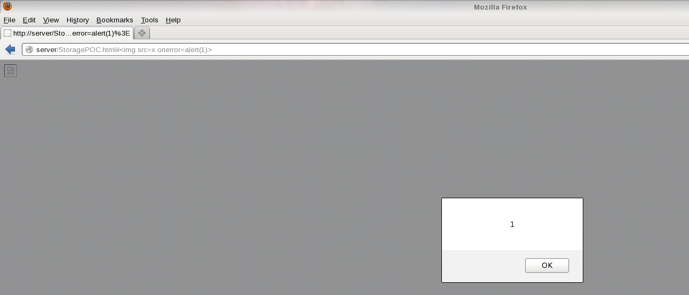

# Testing Web Storage

|ID             |
|---------------|
|WSTG-CLIENT-012|

## Summary

[Web storage](https://www.w3.org/TR/webstorage/) or offline storage, is a mechanism to store data as key value pairs tied to a domain and enforced by the same origin policy (SOP). There are two objects; `localStorage`, which is persistent and is intended to survive browser or system reboots; and `sessionStorage`, which is temporary and will only exist until the browser window or tab is closed.

Data stored in these two objects is kept on the client and never sent to the server. This improves network performance, since data do not travel between the client and server.

### Using `localStorage`

The storage is accessed using the `setItem` and `getItem` functions. This can be accomplished using JavaScript, which makes the storage potentially vulnerable to XSS attacks. Malicious data can also be loaded into the storage via JavaScript. It is important for the application to have controls in place to properly validate untrusted data. If there is more than one application in the same domain, for example, `example.foo/app1` and `example.foo/app2`, both applications will share the same storage.

Data stored in the `localStorage` object will persist after the window is closed. This object should not be used to store sensitive data or session identifiers, as these can be accessed using JavaScript. Session IDs stored in cookies can mitigate this risk using the `HttpOnly` flag.

### Using `sessionStorage`

Data stored in this object is only accessible until the browser tab or window is closed, which makes `sessionStorage` a perfect candidate for data that doesn't need to be persisted between sessions. It has many of the same properties as `localStorage` and uses the `getItem` and `setItem` methods, so manual testing needs to be undertaken to look for these methods and identify which parts of the code access the storage.

## How to Test

### Determine if Web Storage is Used

Testers can attempt to access every element in `localStorage` with JavaScript. Here is an example of code that accomplishes this:

```js
for(var i=0; i<localStorage.length; i++) {
        console.log(localStorage.key(i), " = ", localStorage.getItem(localStorage.key(i)));
}
```

The same code can be applied to `sessionStorage`.

The storage can also be viewed using developer tools in a browser, such as [Google Chrome DevTools Resources](https://developers.google.com/web/tools/chrome-devtools/resources) or [Firefox's Storage Inspector](https://developer.mozilla.org/en-US/docs/Tools/Storage_Inspector).

Testing should be conducted to determine whether the website is storing sensitive data in the storage. The code handling of the storage objects should be examined for possibilities of injection attacks, such as utilizing unvalidated input. JavaScript in particular should be examined to determine if scripts or third party libraries are introducing vulnerabilities.

Here is an example of how insecure assignment from `localStorage` and lack of validation can lead to XSS attacks. An example page has the following code:

```html
<script>
    function action(){
        var resource = location.hash.substring(1);
        localStorage.setItem("item",resource);
        item = localStorage.getItem("item");
        document.getElementById("div1").innerHTML=item;
    }
</script>

<body onload="action()">
    <div id="div1"></div>
</body>
```

By appending to the page URL, testers can cause a pop up to appear.

`http://server/StoragePOC.html#`

\
*Figure 4.11.12-1: Screenshot of storage XSS attack*

For more OWASP resources on the HTML5 Web Storage API, see the [Session Management Cheat Sheet](https://cheatsheetseries.owasp.org/cheatsheets/Session_Management_Cheat_Sheet.html#html5-web-storage-api).
