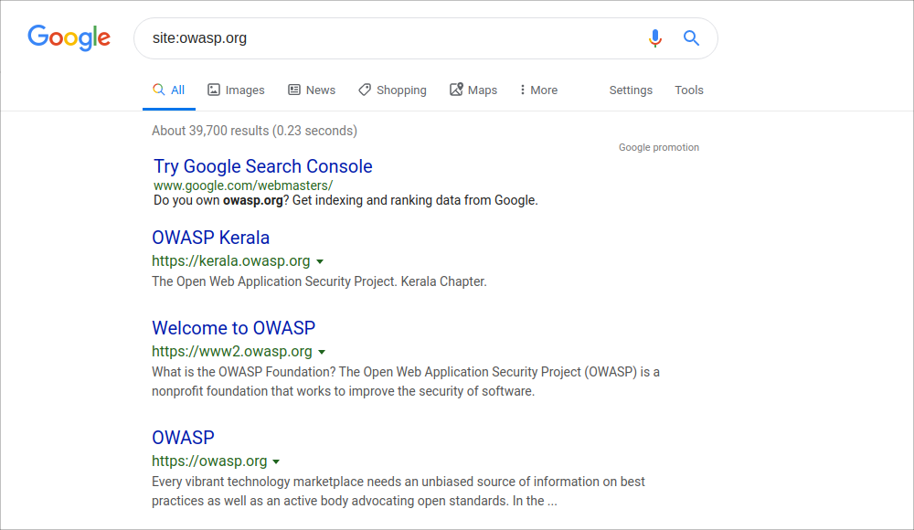
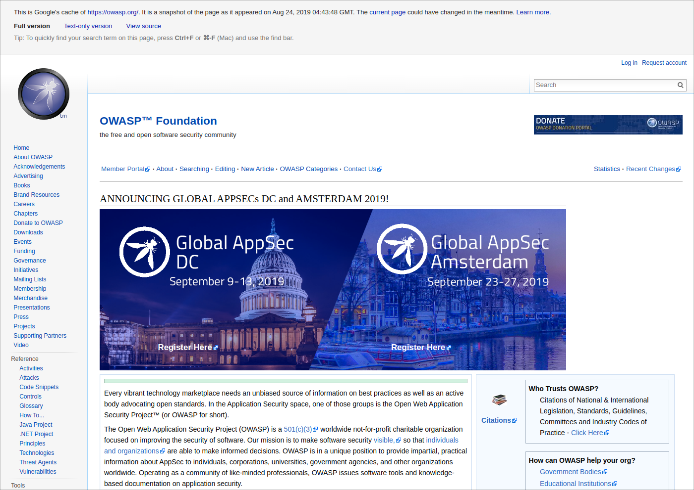

# Conduct Search Engine Discovery Reconnaissance for Information Leakage

## Summary

There are direct and indirect elements to search engine discovery and reconnaissance. Direct methods relate to searching the indexes and the associated content from caches. Indirect methods relate to gleaning sensitive design and configuration information by searching forums, newsgroups, and tendering websites.

Once a search engine robot has completed crawling, it commences indexing the web page based on tags and associated attributes, such as `<TITLE>`, in order to return the relevant search results [[1]]. If the robots.txt file is not updated during the lifetime of the web site, and inline HTML meta tags that instruct robots not to index content have not been used, then it is possible for indexes to contain web content not intended to be included by the owners. Website owners may use the previously mentioned robots.txt, HTML meta tags, authentication, and tools provided by search engines to remove such content.

## Test Objectives

To understand what sensitive design and configuration information of the application, system, or organization is exposed both directly (on the organization's website) or indirectly (on a third party website).

## How to Test

Use a search engine to search for potentially sensitive information. This may include:

- network diagrams and configurations;
- archived posts and emails by administrators and other key staff;
- log on procedures and username formats;
- usernames, passwords, and private keys;
- third-party, or cloud service configuration files;
- revealing error message content; and
- development, test, user acceptance testing (UAT), and staging versions of the website.

### Search Engines

Do not limit testing to just one search engine provider. Different search engines may generate different results, depending on when they crawled content, and their own algorithms. Consider using the following (alphabetically-listed) search engines:

- [Baidu](https://www.baidu.com/), China's most popular search engine [[2]].
- [Bing](https://www.bing.com/), a search engine owned and operated by Microsoft, and the second most popular worldwide [[2]]. Supports [advanced search keywords](http://help.bing.microsoft.com/#apex/18/en-US/10001/-1).
- [binsearch.info](https://binsearch.info/), a search engine for binary Usenet newsgroups.
- [DuckDuckGo](https://duckduckgo.com/), a privacy-focused search engine that compiles results from many different [sources](https://help.duckduckgo.com/results/sources/). Supports [search syntax](https://help.duckduckgo.com/duckduckgo-help-pages/results/syntax/).
- [Google](https://www.google.com/), which offers the world's most popular search engine [[2]], and uses a ranking system to attempt to return the most relevant results. Supports [search operators](https://support.google.com/websearch/answer/2466433).
- [Startpage](https://www.startpage.com/), a search engine that uses Google's results without collecting personal information through trackers and logs. Supports [search operators](https://support.startpage.com/index.php?/Knowledgebase/Article/View/989/0/advanced-search-which-search-operators-are-supported-by-startpagecom).
- [Shodan](https://www.shodan.io/), a paid service for searching Internet-connected devices and services.

Both DuckDuckGo and Startpage offer some increased privacy to users by not utilizing trackers or keeping logs. This can provide reduced information leakage about the tester.

### Search Operators

A search operator is a special keyword that extends the capabilities of regular search queries, and can help obtain more specific results. They generally take the form of `operator:query`. Here are some commonly supported search operators:

- `site:` will limit the search to the provided URL.
- `inurl:` will only return results that include the keyword in the URL.
- `intitle:` will only return results that have the keyword in the page title.
- `intext:` or `inbody:` will only search for the keyword in the body of pages.
- `filetype:` will match only a specific filetype, i.e. png, or php.

For example, to find the web content of owasp.org as indexed by a typical search engine, the syntax required is:

`site:owasp.org`

\
*Figure 4.2.1-1: Google Site Operation Search Result Example*

### Viewing Cached Content

To search for content that has previously been indexed, use the `cache:` operator. This is helpful for viewing content that may have changed since the time it was indexed, or that may no longer be available. Not all search engines provide cached content to search; the most useful source at time of writing is Google.

To view owasp.org as it is cached, the syntax is:

`cache:owasp.org`

\
*Figure 4.2.1-2: Google Cache Operation Search Result Example*

### Google Hacking, or Dorking

Searching with operators can be a very effective discovery reconnaissance technique when combined with the creativity of the tester. Operators can be chained to effectively discover specific kinds of sensitive files and information. This technique, called [Google hacking](https://en.wikipedia.org/wiki/Google_hacking) or Google dorking, is also possible using other search engines, as long as the search operators are supported.

A database of dorks, such as [Google Hacking Database](https://www.exploit-db.com/google-hacking-database), is a useful resource that can help uncover specific information. Some categories of dorks available on this database include:

- Footholds
- Files containing usernames
- Sensitive Directories
- Web Server Detection
- Vulnerable Files
- Vulnerable Servers
- Error Messages
- Files containing juicy info
- Files containing passwords
- Sensitive Online Shopping Info

Databases for other search engines, such as Bing and Shodan, are available from resources such as Bishop Fox's [Google Hacking Diggity Project](https://resources.bishopfox.com/resources/tools/google-hacking-diggity/).

## Remediation

Carefully consider the sensitivity of design and configuration information before it is posted online.

Periodically review the sensitivity of existing design and configuration information that is posted online.

## References

[1]: https://support.google.com/webmasters/answer/70897?hl=en
[2]: https://en.wikipedia.org/wiki/Web_search_engine#Market_share
