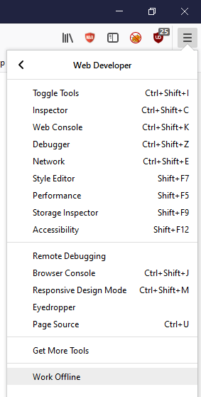

# Leveraging Dev Tools

This appendix outlines various details for use of in browser Developer Tool functionality to aid in security testing activities.

Obviously in browser functionality is not a substitute for: DAST (Dynamic Application Security Testing) tools, SAST (Static Application Security Testing) tools, or a tester's experience, however, it can be leveraged for some testing activities and report production related tasks.

## Accessing Dev Tools

Opening Dev Tools can be accomplished in a number of ways.

1. Via the keyboard shortcut `F12`.
2. Via the keyboard shortcut `ctrl` + `shift` + `i` on Windows.
3. Via the keyboard short cut `cmd` + `option` + `i` on Mac.
4. Via the web page right click context menu and then selecting `Inspect` in Google Chrome.
5. Via the web page right click context menu and then selecting `Inspect Element` in Mozilla Firefox.
6. Via the triple dot 'kabob' menu in Google Chrome then selecting `More Tools` and then `Developer Tools`.
7. Via the triple line 'hamburger' (or 'pancake') menu in Mozilla Firefox then selecting `Web Developer` and then `Toggle Tools`.
8. Via the gear icon settings menu in Edge/IE then selecting `Developer Tools`.

> NOTE: The majority of the instructions below assume that Dev Tools is already open or active.

## Capabilities

| Functionality         | Chrome* | Firefox | Edge/IE | Safari |
|-----------------------|:-------:|:-------:|:-------:|:------:|
| User-Agent Switching  | Y       | Y       | Y       | Y      |
| Edit/Resend Requests  | N       | Y       | N       | N      |
| Cookie Editing        | Y       | Y       | Y       | N      |
| Local Storage Editing | Y       | Y       | Y       | N      |
| Disable CSS           | Y       | Y       | Y       | Y      |
| Disable JavaScript    | Y       | Y       | N       | Y      |
| View HTTP Headers     | Y       | Y       | Y       | Y      |
| Screenshots           | Y       | Y       | Y       | N      |
| Offline Mode          | Y       | Y       | N       | N      |
| Encoding and Decoding | Y       | Y       | Y       | Y      |
| Responsive Design Mode| Y       | Y       | Y       | Y      |

`*` Anything that applies to Google Chrome should be applicable to "New" Edge.

## User-Agent Switching

### Google Chrome

1. Click on triple dot 'kabob' menu on the right side of the Developer Tools pane, select `More tools` then select `Network conditions`.
2. Un-check the “Select automatically” checkbox.
3. Select the user agent from dropdown menu or enter a custom user agent

\
_Figure 6.F-1: Google Chrome Dev Tools User-Agent Switching Functionality_

### Mozilla Firefox

1. Navigate to Firefox’s `about:config` page and click `I accept the risk!`.
2. Enter `general.useragent.override` into the search field.
3. Look for `general.useragent.override`, if you can't see this preference, look for one that show a set of radio buttons `Boolean, Number, String` select `String` then click the plus sign `Add` button on the `about:config` page.
4. Set the value of `general.useragent.override` to whatever [User-Agent](http://www.useragentstring.com/pages/useragentstring.php) you might need.

\
_Figure 6.F-2: Mozilla Firefox User-Agent Switching Functionality_

Later click on the garbage can `Delete` button to the right of the `general.useragent.override` preference to remove the override and switch back to the default user agent.

## Edit/Resend Requests

## Cookie Editing

## Local Storage Editing

## Disable CSS

All major browsers support manipulating CSS leveraging the Dev Tools Console and JavaScript functionality:

* To remove all external style-sheets: `$('style,link[rel="stylesheet"]').remove();`
* To remove all internal style-sheets: `$('style').remove();`
* To remove all in-line styles: `Array.prototype.forEach.call(document.querySelectorAll('*'),function(el){el.removeAttribute('style');});`
* To remove everything from head tag: `$('head').remove();`

## Disable JavaScript

### Google Chrome

1. Click on triple dot 'kabob' menu on the right side of the web developer toolbar and click on `Settings`.
2. On the `Preferences` tab, under the `Debugger` section, check the `Disable JavaScript` checkbox.

### Mozilla Firefox

1. On the dev tools `Debugger` tab, click on the settings gear button in the upper right corner of the developer toolbar.
2. Select `Disable JavaScript` from the dropdown (this is an enable/disable menu item, when JavaScript is disabled the meny item has a check mark).

## View HTTP Headers

## Screenshots

## Offline Mode

### Google Chrome

1. Navigate to `Network` tab.
2. In the `Throttle` dropdown select `Offline`.

\
_Figure 6.F-3: Google Chrome Offline Option_

### Mozilla Firefox

1. From the triple line 'hamburger' (or 'pancake') menu select `Web Developer` and then `Work Offline`.

\
_Figure 6.F-4: Mozilla Firefox Offline Option_

## Encoding and Decoding

All major browsers support encoding and decoding strings in various ways leveraging the Dev Tools Console and JavaScript functionality:

* Base64 encode: `btoa("string-to-encode")`
* Base64 decode: `atob("string-to-decode")`
* URL encode: `encodeURIComponent("string-to-encode")`
* URL decode: `decodeURIComponent("string-to-decode")`
* HTML encode: `escape("string-to-encode")`
* HTML decode: `unescape("string-to-decode")`

## Responsive Design Mode

## Credit

This appendix was assembled based on details from: [Web App Security Testing with Browsers](https://getmantra.com/web-app-security-testing-with-browsers/) along with team modifications and suggestions.
